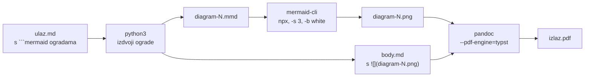

# Markdown u PDF s mermaid dijagramima

Zapisano 4. kolovoza 2026. Povod: dugačak dokument za pripremu intervjua koji
je trebao biti čitljiv offline, s dijagramima, na hrvatskom. Ovo nije CV, pa
ne ide kroz Typst predloške iz `typst/`.

Rezultat je `scripts/md-to-pdf.sh`. Ovaj dokument objašnjava zašto baš takav
oblik, jer se iz same skripte ne vidi što je isprobano i odbačeno.

## Lanac alata



### Zašto typst kao PDF engine

Na stroju već postoji `typst` zbog CV predložaka, a `pandoc` ga podržava kao
engine. To znači **nikakav LaTeX toolchain** nije potreban. Provjereno je i da
typstovi zadani fontovi pokrivaju hrvatsku dijakritiku bez ikakve dodatne
konfiguracije, dakle č, ć, ž, š i đ prolaze out of the box. Nije trebalo
podešavati fontove ni fallbackove.

Alternative koje nisu ni pokušane jer ih na stroju nema: `weasyprint`,
`wkhtmltopdf`. Nema razloga instalirati ih.

### Zašto se mermaid predrenderira

Ni pandoc ni typst ne znaju crtati mermaid. Ograde se moraju pretvoriti u
slike prije nego pandoc uopće vidi dokument. `mermaid-cli` se dohvaća preko
`npx -y @mermaid-js/mermaid-cli@11`, dakle nije trajna ovisnost projekta.

PNG umjesto SVG-a namjerno: mermaid SVG zna nositi reference na fontove koje
typst pri ugradnji ne razriješi isto. `-s 3` daje dovoljnu rezoluciju da tekst
u dijagramu ostane oštar pri zumiranju.

Izvorni `.md` zadržava `mermaid` ograde, pa ostaje čitljiv na GitHubu i u
editoru. PDF je izvedenica, ne zamjena.

## Zamka: široki dijagrami postanu neupotrebljivi

Prvi pokušaj imao je `flowchart TB` s jednim čvorom koji grana u šest
paralelnih djece. Mermaid to rasporedi vodoravno, slika ispadne vrlo široka i
niska, pandoc je skalira na širinu stranice, i tekst u dijagramu padne na
veličinu koja se ne da pročitati.

**Rješenje nije u parametrima renderiranja nego u restrukturiranju grafa.**
Podizanje `-s` ne pomaže jer je problem omjer stranica, ne rezolucija. Šest
paralelnih čvorova spojeno je u jedan čvor s nabrajanjem kroz `<br/>`, i
slika je odmah dobila upotrebljiv omjer.

Pravilo za ubuduće: ako dijagram ima više od tri ili četiri paralelne grane na
istoj razini, spoji ih ili prebaci u `sequenceDiagram`. `sequenceDiagram` i
lančani `flowchart LR` s tri do četiri koraka rendiraju se dobro bez podešavanja.

## Zamka: relativna izlazna putanja

Pandoc se pokreće **iz temp direktorija**, jer samo tamo nalazi renderirane
PNG-ove. Ako je izlazna putanja relativna, PDF završi u temp direktoriju koji
`trap` obriše na izlazu, i skripta javi uspjeh a fajla nema. Skripta zato
pretvara izlaz u apsolutnu putanju prije nego uđe u temp.

Ovo je koštalo jedan prolaz i tiho je: exit code je bio 0, poruka "wrote
izlaz.pdf" se ispisala, a fajl nije postojao.

## Nevezano, ali iz istog dana: konflikti na `dist/`

`stats.yml` u CI-ju tjedno osvježava statistiku i **rebuilda `dist/` PDF-ove**
te ih commita. Ako se u međuvremenu lokalno pokrene `npm run pdf`, rebase na
`origin/main` konfliktira na svih šest binarnih PDF-ova.

Ispravno rješenje **nije** birati stranu (`--theirs` ili `--ours`), jer je CI
gradio iz starijih podataka nego što ih lokalno ima. Ispravno je:

```bash
git rebase origin/main      # konflikt na dist/*.pdf
npm run pdf                 # pregradi iz trenutnog data/
git add dist/
git rebase --continue
```

Time PDF-ovi odgovaraju podacima koji su stvarno u stablu, umjesto da se
naslijepo zadrži jedna od dvije zastarjele verzije.

## Vezani dokumenti

- `docs/data-sources.md` — odakle dolazi svaka brojka i kako je provjeriti
- `scripts/build-pdf.sh` — CV PDF-ovi iz Typst predložaka, drugi lanac
- `scripts/md-to-pdf.sh` — ono što ovaj dokument opisuje
