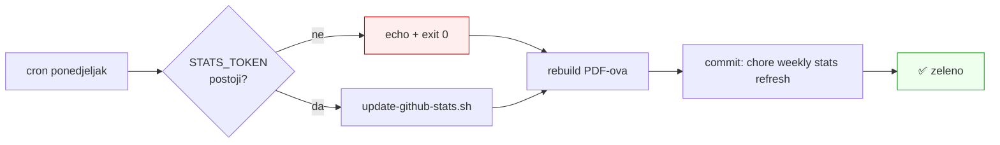

# Statistika je tiho stala: tri tjedna zamrznutih brojki i zašto se to nije vidjelo

**Datum:** 2026-09-15 · **Repo:** `stepanic/cv`

GitHub brojke na `stepanic.domovina.ai` stajale su na očitanju od 2026-08-26 sve
do 2026-09-15. Uzrok nije bio pokvaren skript nego **workflow koji je javljao
uspjeh dok nije radio ništa**. Isti prolaz otkrio je i drugi tihi kvar: korpus
DOMOVINA-e nije rastao šest tjedana, a brojke su izgledale ispravno jer su bile
identične prethodnom očitanju.

Ovaj dokument bilježi dijagnozu, odbačene alternative pri popravku i mjerenja,
jer se ništa od toga ne vidi iz diffa.

## Što je bilo zamrznuto

| Brojka | Stajalo na | Stvarno (2026-09-15) |
|---|---|---|
| contributions bez arhive | 4.465 | **4.949** |
| sirovi GitHub brojač | 37.098 | **37.659** |
| commitovi dataset arhive | 32.633 | **32.710** |
| javnih repoa | 110 | **113** |

Claude Code telemetrija nije bila zamrznuta na isti način, samo neosvježena:
21,27 → **25,66 mlrd** tokena, 4.157 → **4.822** sesije, $20.516 → **$24.374**
API-ekvivalenta. Nju ionako može osvježiti samo lokalni `npm run stats:claude`,
što je poznato i zapisano u `CLAUDE.md`.

## Kvar 1: workflow koji izlazi sa nulom

`.github/workflows/stats.yml` imao je ovo:

```bash
if [ -z "$GH_TOKEN" ]; then
  echo "STATS_TOKEN secret not set — skipping refresh." && exit 0
fi
```

`STATS_TOKEN` nikad nije postavljen (`gh secret list` vraća prazno). Svaki
ponedjeljni run od barem 2026-08-17 ispisao je tu poruku, izašao sa 0 i
**prijavio success**. Provjera:

```bash
gh run list --workflow=stats.yml --limit 5
gh run view <id> --log | grep -i skipping
```

Pet uzastopnih zelenih runova, nijedan nije dirao `github-stats.json`.



Commit poruke su govorile „weekly stats refresh" svaki tjedan, pa je i git
povijest izgledala zdravo. Jedino što se doista mijenjalo bili su PDF-ovi, iz
razloga koji nema veze s podacima.

**Popravak:** korak sad izlazi s greškom i piše razlog u `$GITHUB_STEP_SUMMARY`.
Crveni tjedni run je jedini signal koji doista dođe do nekoga.

**Otvoreno:** dok se ne kreira classic PAT (`repo` + `read:user`) i ne postavi
kao `STATS_TOKEN`, tjedni run je crven po dizajnu. To je namjerno.

## Kvar 2: PDF-ovi koji se mijenjaju bez promjene sadržaja

Zašto je mrtvi job uopće imao što commitati? Typst upisuje datum nastanka
PDF-a sa zidnog sata, pa dva builda istog, nepromijenjenog CV-a daju različite
bajtove:

```
NON-DETERMINISTIC: rebuild differs with no data change
     100        # broj različitih bajtova, cmp -l
```

Šest binarnih fajlova tjedno, bez ijedne promjene sadržaja.

**Popravak:** `scripts/build-pdf.sh` pina `SOURCE_DATE_EPOCH`. Nakon toga su
dva uzastopna builda bajt-identična.

### Odbačene alternative za izvor epohe

| Izvor | Zašto ne |
|---|---|
| `SOURCE_DATE_EPOCH=0` | Radi savršeno, ali PDF-u piše datum nastanka 1970-01-01. CV otvaraju ljudi i ATS-ovi. |
| hash sadržaja ulaza | Deterministički, ali daje besmislene datume koji skaču naprijed-nazad. |
| `date` pri commitu CI-ja | Vraća isti problem: svaki run nova vrijednost. |
| **`git log -1 --format=%ct -- data typst`** | **Odabrano.** Datum prati zadnju stvarnu promjenu sadržaja CV-a. |

Zamka u odabranom rješenju, koja nije očita: nakon što CI commita osvježene
podatke, sljedeći run računa **noviju** epohu nego što su imali commitani
PDF-ovi, pa ih jednom rebuilda i commita. Petlja se **sama smiruje**, jer taj
drugi commit dira samo `dist/`, pa `git log -- data typst` ostaje na istom
commitu i treći run više ne vidi razliku. Churn je dakle ograničen na jedan
commit nakon svake stvarne promjene podataka, a ne tjedni.

Druga zamka, ozbiljnija: `git log` s pathspecom na **plitkom klonu** zna vratiti
prazno. Tada bi `SOURCE_DATE_EPOCH` pao na fallback, CI bi stampao drugi datum
nego lokalni build, i churn bi se vratio u gorem obliku. Zato checkout u
workflowu sad ima `fetch-depth: 0`. To nije kozmetika nego uvjet ispravnosti.

## Kvar 3: korpus koji stoji, a izgleda svjež

Očitanje korpusa 2026-09-15 bilo je **identično** onom od 2026-08-26:

```
3.157 epizoda · 48 kanala · 144.294 chunka · ~2.990 h · 2.698 govornika
```

Identično na oba izvora, uključujući isti razmak od 680 chunkova između MCP-a i
`stats.domovina.ai` snapshota. Taj razmak je prije bio dokaz normalnog kašnjenja
dnevnog crona; sad je dokaz da **oba izvora stoje**.

Presudno polje nije broj epizoda nego `latest_upload`: **2026-07-30**. Šest
tjedana bez nove epizode. Brojke u CV-u su točne, ali su točne zato što korpus
ne raste, ne zato što su svježe izmjerene.

**Pravilo koje iz ovoga slijedi:** pri provjeri korpusa čitaj polje recentnosti,
ne samo brojače. Dva jednaka očitanja mogu značiti da se ništa ne miče.
Provjeriti `domovinatv/fetch.domovina.tv`.

## Što je provjereno i stoji

- Docker Hub `microblink/api`: 4.161.521 pull, +1.156 u dvadeset dana. „4,1M" drži.
- Katalozi otvorenih podataka: `klubovi` 901, `stranke` 434, `zakoni` 97.561 /
  5.077, `izbori` ~70.000. Sve nepromijenjeno, `zakoni` backfill i dalje pauziran
  nakon 2024.
- Svih 52 URL-a u `data/` vraćaju 200. LinkedIn 999 i Toptal 403 su blokade
  botova, ne mrtvi linkovi.
- Datumi u `experience.yaml`, godine u `skills.yaml`, blog indeks: bez drifta.

## Katalog je propustio četiri projekta

Nastali nakon zadnjeg sweepa, svi unutar allow-liste vlasnika: `linkedin-poster`,
`claude-tmux-teams`, `udruge.domovina.ai` (864 udruge), `oou.domovina.ai` (2.241
ustanova na 4.529 lokacija). Dodani kao `featured: false`, dakle na web da, u PDF
ne, i upisani u `typst/lib.typ` jer Typst ne zna globati direktorij.

Sweep koji ih nalazi već je zapisan u `docs/data-sources.md`, poglavlje
„Enumerating Matija's own work". Nije pokrenut od 2026-08-26.

## Dopuna: račun je nadopunjen do 2026-08-25

Isti dan je Matija ubacio popis računa s Anthropicove naplatne stranice, pa je
knjiga u `docs/claude-usage-history.md` §4.4 produljena za četiri stavke:
2026-06-27 (€90,00), 2026-07-09 (€125,47), 2026-08-13 (€18,00) i 2026-08-25
(€78,92), ukupno €312,39.

| | prije | sad |
|---|---|---|
| računa | 38 | **42** |
| bruto ukupno | €1.662,58 | **€1.974,97** |
| raspon | → 2026-05-27 (16 mj) | → **2026-08-25 (19 mj)** |
| prosjek/mjesec | €103,91 | **€103,95** |

Tri stavke koje su se preklapale s prethodnim snimanjem (2026-03-27, 2026-04-27,
2026-05-27) poklopile su se **točno u lipu**. To je ono što ih čini dopunom, a
ne ponovnim čitanjem, i jedini razlog zbog kojeg se smjelo samo zbrajati.

Zbroj se ne računa u glavi nego iz same tablice; naredba je zapisana u
`docs/data-sources.md`, poglavlje „Anthropic invoices". Vraća
`42 1974.97 True`, gdje je `True` provjera da numeracija ide 1..42 bez rupe.

Redoslijed uređivanja nije proizvoljan: `data/claude-history.yaml` u zaglavlju
zabranjuje brojke kojih nema u izvornom dokumentu, pa prvo ide §4.4, zatim
izvedene brojke u §7 i §9, pa tek onda YAML i `npm run stats:claude`.

### Poluga pretplate, uz ogradu

Uz nadopunu je u §9 dodan omjer koji brojke sad omogućuju: rudareno korištenje
Claude Codea po javnom API cjeniku iznosi **$24.460,85**, a stvarno plaćeno je
**€1.974,97**. Omjer pada između 10,3× i 11,8× na bilo kojem recentnom tečaju
EUR/USD, pa je poštena formulacija „otprilike red veličine", ne fiksni
multiplikator.

Dvije ograde drže taj broj u kategoriji ilustracije: plaćeni iznos pokriva
**sve** Anthropicove proizvode, a API-ekvivalent samo Claude Code transkripte;
i ~97 % tih tokena su cache readovi, koje nitko ne bi plaćao po punoj cijeni u
stvarnom API opterećenju.

## Vezani dokumenti

- `docs/data-sources.md` — izvor po izvor, naredba i očitanje s datumom
- `docs/claude-usage-history.md` — povijest korištenja i puna knjiga računa (§4.4)
- `docs/committers-top-timestamps.md` — ista korekcija arhive na javnoj ljestvici
