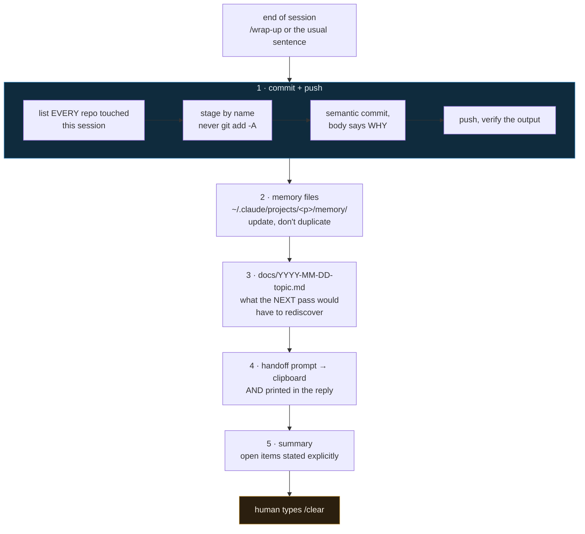

# `/wrap-up` — a Claude Code skill mined out of my own transcripts

> **TL;DR** I noticed I was typing almost the same paragraph at the end of every
> Claude Code session. Instead of writing a skill from memory, I searched 145
> projects' worth of local transcripts, counted what I actually asked for, and
> turned the measured distribution into a skill. It has run 47 times since
> 2026-08-04.

- [`SKILL.md`](SKILL.md) — the skill, English, generic. This is the one to install.
- [`SKILL.hr.md`](SKILL.hr.md) — the Croatian original, verbatim as it runs on my
  machine (repo names and all). Kept because it is the artefact that was actually
  measured into existence.

Blog post with the full story: **[stepanic.domovina.ai/blog/wrap-up-skill-mined-from-my-own-transcripts](https://stepanic.domovina.ai/blog/wrap-up-skill-mined-from-my-own-transcripts)**

## Install

User-level, so it works in every project:

```bash
mkdir -p ~/.claude/skills/wrap-up
curl -sSL https://raw.githubusercontent.com/stepanic/cv/main/skills/wrap-up/SKILL.md \
  -o ~/.claude/skills/wrap-up/SKILL.md
```

Or project-level, checked into a repo so a team shares it:

```bash
mkdir -p .claude/skills/wrap-up && cp SKILL.md .claude/skills/wrap-up/SKILL.md
```

Then invoke it as `/wrap-up` — or just keep typing your usual end-of-session
sentence. The `description:` field carries the real trigger phrases, so the skill
fires on its own without anyone having to remember a new command. That dual entry
point is the point: a shortcut you have to remember is a shortcut you will forget.

## What it does



The framing that makes step 3 work is one question: **not "what did we do"** (git
already knows) **but "what would the next pass have to rediscover"** — rejected
alternatives and why, the measurement that decided a threshold, the silent failure
that cost an afternoon.

## How it was designed: measured, not guessed

The prompt that started it, on 2026-08-04, was roughly *"I keep writing nearly the
same prompt at the end of every chat, you can see it by searching my Claude Code
sessions, automate it."* The important half of that is the middle: **the evidence
was already on disk.**

Claude Code stores every session as JSONL under `~/.claude/projects/`. At the time
that was 145 project directories and 2.5 GB. So the first move was not writing the
skill, it was counting:

```bash
cd ~/.claude/projects
grep -rliE "pripremi.{0,30}chat za clear" --include=*.jsonl . | wc -l
# 147
```

147 sessions, and after deduplicating the user-typed messages, **119 distinct
phrasings of the same request**. Then the part that actually shaped the file —
counting which steps appear in the fullest variants:

| step asked for | share of variants |
|---|---|
| "prepare the chat for clear" | **100 %** |
| commit + push | 88 % |
| update memory files | 70 % |
| write a markdown document | 41 % |
| mermaid diagram | 12 % |
| touch `docs/` or `CLAUDE.md` explicitly | 0 % |

Two things fell out of that table that I would have got wrong from memory:

1. **Mermaid is not a default.** I *feel* like I ask for diagrams often; I ask for
   them 12 % of the time. So the skill says *"use mermaid when a relationship or a
   flow is not obvious from prose. Do not draw a diagram for something that is one
   sentence."* A skill that drew a diagram every run would have been faithful to my
   self-image and wrong about my behaviour.
2. **The handoff prompt was missing from the request.** It appears in the longest
   variants and it was already recorded in a memory file, but it is not in the
   sentence I type. It became step 4 anyway. Mining the transcripts surfaced a step
   my own prompt had stopped mentioning because I assumed it.

## The rule in red

**Never `git add -A`.** That line is in the skill because of the session that
created it: the working copy of a neighbouring repo held an unfinished `.gitignore`
and a set of half-written shell scripts, sitting there untracked while unrelated
work was being committed. `git add -A` would have shipped them to `main` half-done.

So the skill stages **by name**, and for any modified file the agent does not
remember touching it runs `git diff` and leaves it alone if it is not its own. The
same paragraph forbids committing cron-written snapshots and `.env`.

This is the general shape of a good skill rule: not a preference, a **near-miss
written down** so it cannot happen twice.

## Does it hold up

Between 2026-08-04 and 2026-08-26 the skill fired **47 times across 11 working
days**, in every repo I touched — not just the one it was born in. The failure mode
it removes is not typing effort. It is the session that ends with a good
measurement, a rejected approach and a reason, all of it alive only in a context
window that is about to be cleared.

## Mine your own

The method transfers to any prompt you keep retyping:

```bash
cd ~/.claude/projects

# 1. how often does the pattern actually occur?
grep -rliE "<your recurring phrase>" --include=*.jsonl . | wc -l

# 2. what are the real variants? (user-typed messages only)
python3 - <<'PY'
import json, glob, re, collections
pat = re.compile(r"<your recurring phrase>", re.I)
variants = collections.Counter()
for f in glob.glob("*/*.jsonl"):
    for line in open(f, encoding="utf-8", errors="ignore"):
        try: d = json.loads(line)
        except Exception: continue
        if d.get("type") != "user": continue
        c = d.get("message", {}).get("content")
        if isinstance(c, list):
            c = " ".join(p.get("text", "") for p in c
                         if isinstance(p, dict) and p.get("type") == "text")
        if not isinstance(c, str): continue
        t = c.strip()
        # drop injected skill text and system blocks, keep human sentences
        if t.startswith("<") or "Base directory for this skill" in t: continue
        if len(t) > 400: continue
        if pat.search(t): variants[t] += 1
print(len(variants), "distinct variants;", sum(variants.values()), "occurrences")
for t, n in variants.most_common(20): print(n, "×", t[:100].replace("\n", " "))
PY
```

Then write the skill against the counts, not against your recollection. Put the
real phrasings into `description:` so it triggers without a command. And write down
the near-misses as hard rules.

Two caveats on the archaeology, both of which bit me:

- **The 30-day pruning is a default, not a law.** Claude Code deletes local
  transcripts after 30 days, but `cleanupPeriodDays` in `~/.claude/settings.json`
  sets that window — I run `365`. Raise it *before* you need the history; the
  setting cannot bring back what has already gone. For a durable copy, back the
  directory up as well: [dotclaude-sync](https://github.com/stepanic/dotclaude-sync)
  mirrors all of `~/.claude` — transcripts, settings **and the memory files** —
  into a daily git snapshot and pushes it to a private remote (Google Drive, in my
  case). That archive is what my published usage stats are built from.
- **The skill contaminates its own evidence.** Once `description:` contains your
  trigger phrases, every session that loads the skill list contains them too, so a
  naive `grep` count balloons. Filter to `type == "user"` messages that a human
  actually typed, as the script above does.

## Licence

MIT, same as the rest of this repo. Take it, rename it, change the steps. The part
worth copying is the method, not my five steps.
